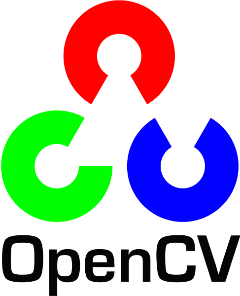

### Hi there! I'm Clarence, aka [brighttux][website]

## Interest:
- Computer Vision
- DevOps
- Mechanical Keyboards
- Terminal Applications

### Connect with me:

[][instagram]
[][linkedin]

### Tools and Languages:

[] 
[] 
[]
[]
[]

### List of Mechanical Keyboards:

- Idobo75
- S50

[website]: https://brighttux.github.io
[instagram]: https://www.instagram.com/clarence.han
[linkedin]: https://www.linkedin.com/in/clarence-cheong
